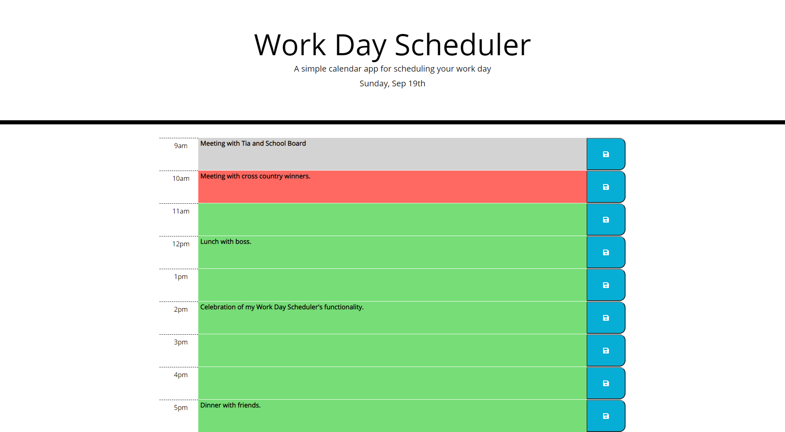

# Work Day Scheduler

A simple calendar app for scheduling your work day.

## Functionality

- Click on the central, color-coded blocks to add or change events for that hour.
- Use the blue, save buttons on the right of each corresponding description block to save your changes.
- Colors update as time passes:
    - Grey - past hours
    - Red - present hour
    - Green - future hours

## Screenshot

## Link to Live Page

https://concord511.github.io/Workday-Scheduler/